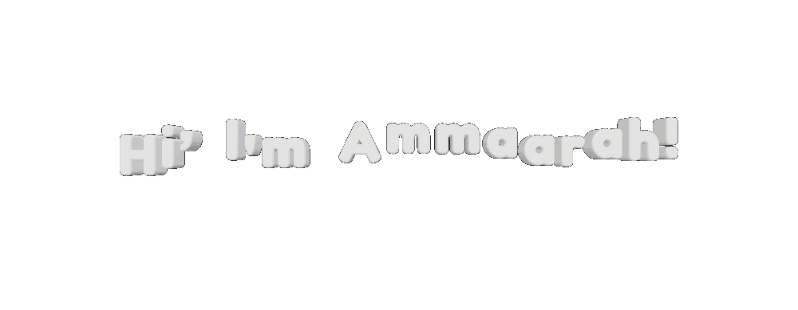
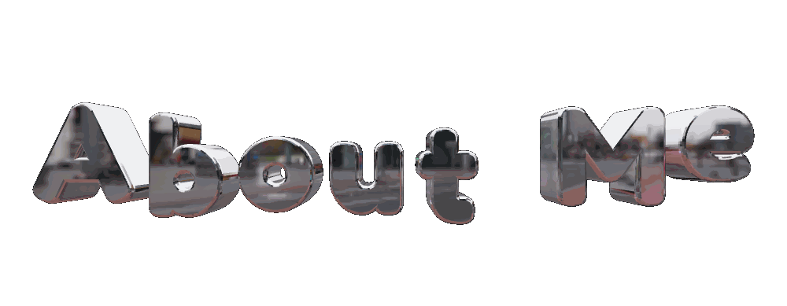
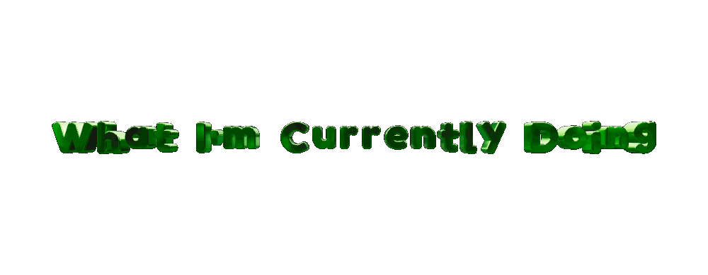
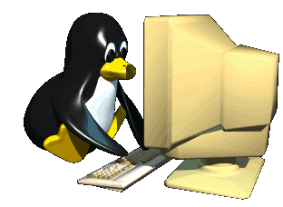
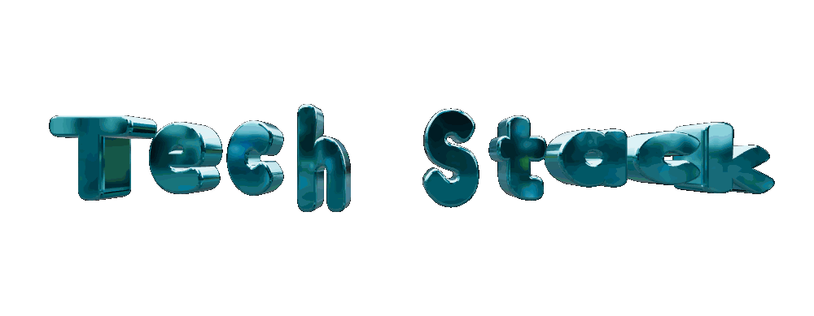
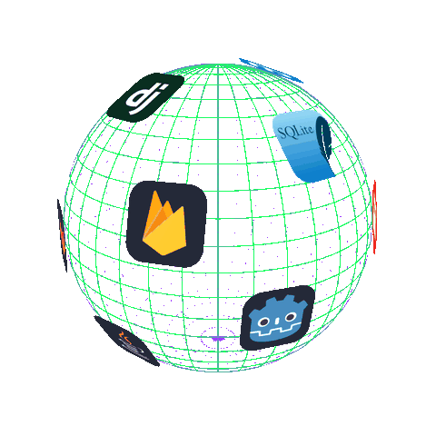
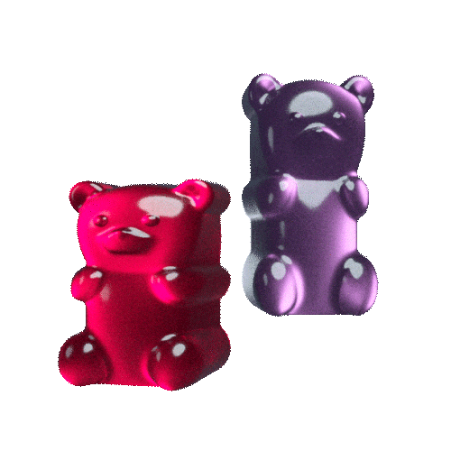

  

 

 

 

I'm **Ammaarah**, a creative developer who enjoys bringing ideas to life through **code, design and technology**.

I'm currently learning and growing through **WeThinkCode_**, where I'm developing my programming skills and working on real-world projects.

I enjoy combining the logical side of programming with the creative side of design — from building applications and websites to creating interfaces that feel simple, useful and visually appealing.

  
  &nbsp; Learning and improving my software development skills

  
  &nbsp;  Building projects with Java, Python, Dart, Flutter, Firebase and web technologies

  
  &nbsp; Exploring front-end and full-stack development

  
  &nbsp; Learning more about UI/UX and graphic design

  
  &nbsp; Building projects that help me grow my portfolio

  
  &nbsp; Continuously exploring new programming languages and technologies

 
 

> Small progress is still progress. Keep building.
  

 

<h3>Tech Stack:</h3>

<strong>Languages</strong> 
Python • Java • Dart • JavaScript • HTML • CSS
 

  

<strong>Frameworks & Development</strong> 
Django • Firebase • SQLite • Flutter
 

  

  

  <strong>Tools & Platforms</strong> 
  Git • GitHub • GitLab • VS Code • IntelliJ • Figma
   
  
  

 

 

  
  
  
  

    My goal is to become a well-rounded developer who can combine 
    technical skills with creativity to build meaningful digital experiences.
  

   

  

---

## 🐍 Contribution Garden

<picture>
  <source
    media="(prefers-color-scheme: dark)"
    srcset="https://raw.githubusercontent.com/ammaarah14/ammaarah14/main/dist/github-contribution-grid-snake-dark.svg"
  />
  <source
    media="(prefers-color-scheme: light)"
    srcset="https://raw.githubusercontent.com/ammaarah14/ammaarah14/main/dist/github-contribution-grid-snake.svg"
  />
  
</picture>

 

🌱 **Growing one contribution at a time.** 🌸

---

## 🌷 Featured Projects

### 📚 Study Buddy

  

### 🔐 Password Checker

  

### 🛍️ E-Commerce Store

---

## 🌿 What I Love Building

🌸 **Beautiful Interfaces**
*Creating clean and enjoyable digital experiences.*

 

🌱 **Useful Applications**
*Turning everyday ideas into practical software.*

 

💻 **Real-World Projects**
*Learning by building, experimenting and solving problems.*

 

🎨 **Creative Digital Experiences**
*Combining technology with design and creativity.*

---

## 💌 Let's Connect

  

🌷 **Let's build something amazing together.** 🌿

---

### 🌱 Always Learning • 🌸 Always Creating • ✦ Always Growing

 

<picture>
  <source
    media="(prefers-color-scheme: dark)"
    srcset="https://capsule-render.vercel.app/api?type=waving&height=160&section=footer&color=0:355C4D,45:9CAF88,75:EFA3C2,100:F8D7E3"
  />
  <source
    media="(prefers-color-scheme: light)"
    srcset="https://capsule-render.vercel.app/api?type=waving&height=160&section=footer&color=0:9CAF88,45:EFA3C2,75:F8D7E3,100:FFF9FB"
  />
  
</picture>

